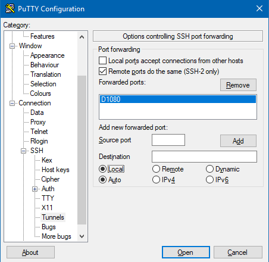
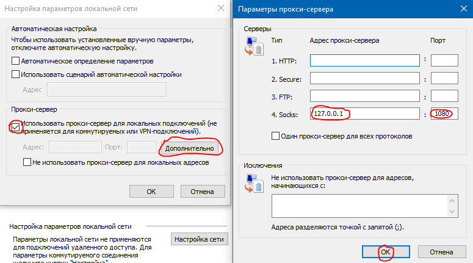

# Прокси.

## Intro

Простой сокс5 прокси сервер был установлен на нашем облаке, чтобы использовать его для доступа к AWS в случае проблем с локальным провайдером (некоторые подсети амазона все еще заблокированы), а также с точки зрения безопасности кластера извне.

Прокси работает с браузерами только через туннель. Это, в общем-то, фундаментальное ограничение, так как через туннель происходит авторизация, а браузеры не авторизуют вход на прокси сервер.

Итак, как это выглядит в целом. Сначала вы создаете ssh туннель на машину, на которой запущен прокси сервер. Затем вы конфигурируете прокси-соединение в вашем браузере, причем в качестве сервера выступает localhost - это "начало" туннеля, который вы создали через ssh.

Таким образом, каждый раз, когда вы захотите воспользоваться прокси соединением, вам придется создать туннель. Это не очень удобно, так как, например, если ваш лаптоп заснет, то туннель придется поднимать заново. Поэтому мы рекомендуем использовать отдельный браузер с настройками прокси для доступа к Амазону, а в вашем основном браузере использовать "обычный" интернет от локального провайдера.


## Как настроить туннель

# MAC only

Откройте терминал и запустите каманды

`$ pip install sshuttle`

`$ sudo sshuttle -r ivan.ivanov@master.cluster-lab.com 0.0.0.0/0 --ssh-cmd 'ssh -i <полный путь к приватному ключу>'`
запросит пароль от учетки мака

# MAC, Linux

Откройте терминал и запустите каманду

`ssh username@master.cluster-lab.com  -D localhost:1080 -N`

Введите пароль, который тут не приводится по соображениям безопасности (пароль от личного кабинета).

Если все нормально, то вы увидите такое:

```
$ ssh username@master.cluster-lab.com  -D localhost:1080 -N
The authenticity of host '[master.cluster-lab.com]:2225 ([46.16.190.70]:2225)' can't be established.
ECDSA key fingerprint is SHA256:7MKLgfuPQRyZmONxDsmQPNf+KmBehPNfuV07WgJrgfk.
Are you sure you want to continue connecting (yes/no)? yes
Warning: Permanently added '[master.cluster-lab.com]:2225,[46.16.190.70]:2225' (ECDSA) to the list of known hosts.
proxy@master.cluster-lab.com's password:

```
После пароля - ничего не происходит. Но есть туннель. Переходите в секцию Настройка браузера.

Для упрощения создания туннеля можно добавить следующую секцию в ваш .ssh/config

```
Host nplp
HostName master.cluster-lab.com 
Port 22
User name.surname
DynamicForward 1080

```

Тогда вы сможете запустить тунель как: `ssh -N nplp`

### Windows

Настройте новую сессию Putty на name.surname@master.cluster-lab.com port 22

Будьте внимательны и настройте оцпии ssh:

настраиваем туннель:


должно выглядеть вот так:



настраиваем, чтоб не выходило из терминала:


Не забудьте сохранить сессию!

Открываем, вводим пароль (пароль от личного кабинета), при успешном логине ничего не происходит, промпта нет.

## Настройка браузера

Так как неразумно использовать прокси для всего вашего трафика все время, то предлагаю взять для этого дела неиспользуемый браузер, и выделить его для нашего Слака. Например, я пользуюсь файрфоксом в качестве основного браузера и сконфигурирую chromium для работы с проксёй.

## На примере Хром

Хром на Линукс и MAC OS почему-то не поддерживает настройку прокси через Settings, поэтому два пути ниже. А под Windows настройка прокси системная, смотрите описание настройки Internet Explorer. (Таким образом, вы не можете использовать Chrome и Internet Explorer для разных целей - они либо вместе без прокси, либо вместе с прокси.)

### В командной строке

`chromium-browser --proxy-server=socks5://localhost:1080`

### С помощью расширения

Устанавливаем 
https://chrome.google.com/webstore/detail/proxy-helper/mnloefcpaepkpmhaoipjkpikbnkmbnic

и настраиваем в соответствие с картинкой


## На примере Файрфокс

Preferences->General->Network Proxy->Settings...


### Safari

Your description here.

### Internet Explorer

Настройки Брузера-Соединения-





### Edge

Your description here

## Проверка

Зайдите на сайт ifcofig.io и проверьте, что ваш адрес начинается с 46...


